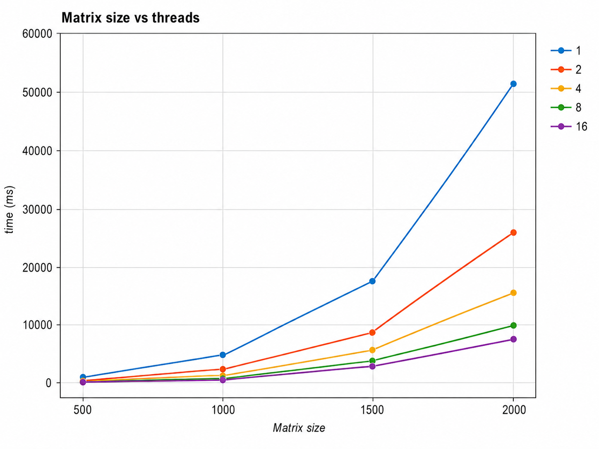

# Отчет
# Практическое задание 6. POSIX потоки

## Описание

В этой работе я познакомился с POSIX-потоками в языке C.

В заданиях использовались:

- `pthread_create()` — создание потока;
- `pthread_join()` — ожидание завершения потока;
- `pthread_cancel()` — отмена потока;
- `pthread_cleanup_push()` — действие перед завершением потока;
- `pthread_mutex_t` — защита общих данных;
- `pthread_cond_t` — ожидание нужного условия.

Также были сделаны перемножение матриц в несколько потоков, замер времени и простая очередь сообщений.

---

## Сборка

Для сборки нужен флаг `-pthread`.


# Задания 1–6

## Задание 1. Создание потока

В первом задании создается один дочерний поток.

Дочерний поток выводит 5 строк, и основной поток тоже выводит 5 строк.

Поток создается так:

```c
pthread_create(&t, NULL, child_simple, NULL);
```

`NULL` означает, что используются обычные настройки потока.

---

## Задание 2. Ожидание потока

Во втором задании основной поток сначала ждет завершения дочернего потока.

Для этого используется:

```c
pthread_join(t, NULL);
```

После этого основной поток начинает выводить свои строки.

То есть сначала работает дочерний поток, потом основной.

---

## Задание 3. Параметры потока

В третьем задании создаются 4 потока.

Каждый поток получает свой номер и по этому номеру выводит свои строки.

```c
ids[i] = i;
pthread_create(&threads[i], NULL, print_text, &ids[i]);
```

Массив `ids` нужен, чтобы у каждого потока был свой номер.

---

## Задание 4. Отмена потоков

В четвертом задании потоки выводят строки с задержкой:

```c
sleep(1);
```

Основной поток ждет 2 секунды и отменяет дочерние потоки:

```c
pthread_cancel(threads[i]);
```

После этого используется `pthread_join()`, чтобы дождаться завершения потоков.

---

## Задание 5. Обработка завершения потока

В пятом задании добавлена функция, которая вызывается перед завершением потока.

Для этого используется:

```c
pthread_cleanup_push(cleanup, arg);
```

Если поток отменяется, вызывается `cleanup()` и выводится сообщение о завершении потока.

---

## Задание 6. Sleepsort

В шестом задании сделан простой Sleepsort.

Для каждого числа создается поток.  
Поток засыпает на это число секунд, а потом выводит число.

```c
sleep(number);
printf("%d\n", number);
```

Например, для массива:

```c
int nums[] = {3, 1, 4, 2, 5};
```

числа выводятся в порядке:

```text
1
2
3
4
5
```

---

# Задание 7. Синхронизированный вывод

В этом задании основной и дочерний поток выводят строки по очереди.

Порядок такой:

```text
Main: line 1
Child: line 1
Main: line 2
Child: line 2
```

Для этого используются mutex и условная переменная:

```c
pthread_mutex_t m;
pthread_cond_t c;
```

Переменная `turn` показывает, чей сейчас ход.

```c
turn = 0; // печатает main
turn = 1; // печатает child
```

Mutex нужен, чтобы два потока не меняли `turn` одновременно.

---

# Задание 8. Перемножение матриц

В этом задании сделано перемножение квадратных матриц.

Матрицы `A` и `B` заполнены единицами.  
Результат записывается в матрицу `C`.

Главная формула:

```c
C[i][j] += A[i][k] * B[k][j];
```

Потоки делят между собой строки матрицы `C`.

Например, если `N = 4`, а потоков `2`, то:

```text
первый поток считает строки 0 и 1
второй поток считает строки 2 и 3
```

---

# Задание 9. Замер времени

В этом задании измерялось время перемножения матриц.

Время измерялось от момента перед созданием потоков до момента после `pthread_join()`.

Для замера использовалось:

```c
clock_gettime(CLOCK_MONOTONIC, &start);
clock_gettime(CLOCK_MONOTONIC, &end);
```

Результаты:

| Размер матрицы | 1 поток | 2 потока | 4 потока | 8 потоков | 16 потоков |
|---:|---:|---:|---:|---:|---:|
| 500  | 482.89 ms   | 199.24 ms   | 142.79 ms   | 87.78 ms   | 79.28 ms   |
| 1000 | 4468.63 ms  | 2012.06 ms  | 1106.06 ms  | 725.79 ms  | 576.12 ms  |
| 1500 | 16878.54 ms | 7502.92 ms  | 4142.10 ms  | 2788.30 ms | 2464.87 ms |
| 2000 | 51097.28 ms | 25844.30 ms | 15013.12 ms | 9541.22 ms | 7574.37 ms |

## График




## Вывод по графику

По графику видно, что чем больше матрица, тем больше время выполнения.

Также видно, что при увеличении количества потоков программа работает быстрее.

Например, для матрицы `2000 x 2000`:

```text
1 поток   — 51097.28 ms
2 потока  — 25844.30 ms
4 потока  — 15013.12 ms
8 потоков — 9541.22 ms
16 потоков — 7574.37 ms
```

Так происходит потому, что строки матрицы делятся между потоками.

Но ускорение не идеально, потому что потоки тоже требуют времени на создание, завершение и переключение между ними.

---

# Задание 10. Производитель-потребитель

В этом задании сделана очередь сообщений FIFO.

Клиенты добавляют сообщения в очередь.  
Серверы берут сообщения из очереди и выводят их на экран.

Очередь хранит максимум 10 сообщений:

```c
#define QUEUE_SIZE 10
```

Максимальная длина сообщения — 128 символов:

```c
#define MAX_MSG 128
```

Функция отправки:

```c
int msgSend(char *msg);
```

Функция получения:

```c
int msgRecv(char *buf, size_t size);
```

Если очередь полная, клиент ждет.

Если очередь пустая, сервер ждет.

Для синхронизации используются:

```c
pthread_mutex_t m;
pthread_cond_t not_empty;
pthread_cond_t not_full;
```

`not_empty` нужен, чтобы сервер ждал появления сообщения.

`not_full` нужен, чтобы клиент ждал свободного места.

---
