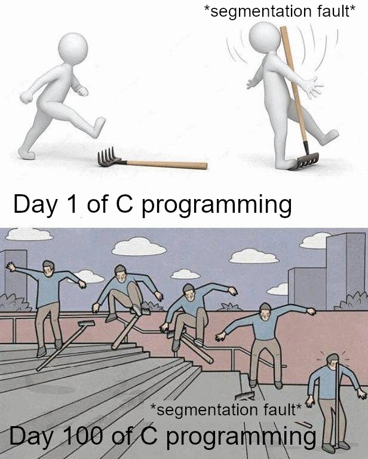

# Лабораторные и практические работы по C/C++

В данном репозитории собраны лабораторные и практические работы по дисциплине программирования на языке C/C++.

## Список работ

| Папка | Название работы |
|---|---|
| lab5 | Практическое задание 5. Массивы |
| lab6 | Практическое задание 6. Матрицы |
| lab7 | Практическое задание 7. Строки |
| lab8 | Практическое задание 8. Матрицы и динамическая память |
| lab9 | Практическое задание 9. Git |
| lab10 | Практическое задание 10. Структуры |
| lab11 | Практическое задание **. Упс, а тут пусто
| lab12 | Практическое задание 12. Многофайловый проект. Библиотеки |
| lab13 | Практическое задание 13. Системы сборки Make и CMake |
| lab14 | Практическое задание 14. Списки |
| lab15 | Практическое задание 15. Файлы |
| lab16 | Практическое задание 11. Отладчик |
| lab17 | Практическое задание 16. Потоки |
| lab18 | Практическое задание 17. Тестирование |
| lab19 | Практическое задание 18. C++ |

## Используемые технологии

- C
- C++
- CMake
- Make
- Git
- GDB
- Valgrind
- AddressSanitizer
- POSIX Threads
- CMocka
- CTest
- SFML

