Этот документ содержит скриншоты команд для задания на 3, 4 по git
Далее представлены скриншоты в формате: Заголовок-номер пункта, ниже скриншот
 На 3:
#### 1
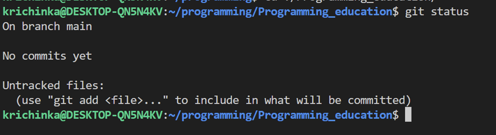

#### 2.

 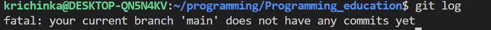

#### 3-4.

#### 5-15.

 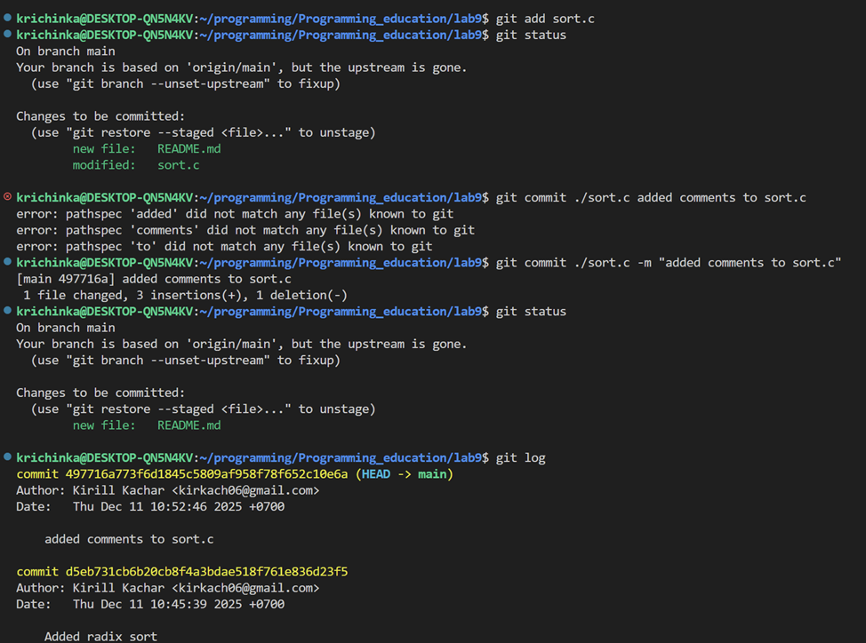
#### 16.

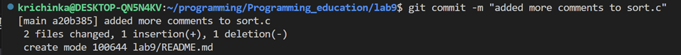
#### 17.

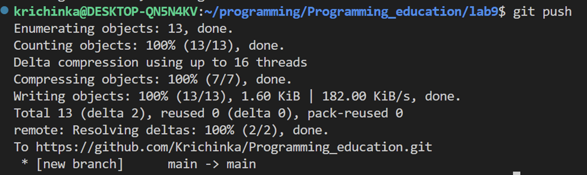

#### Ветки:
#### 1-10
  
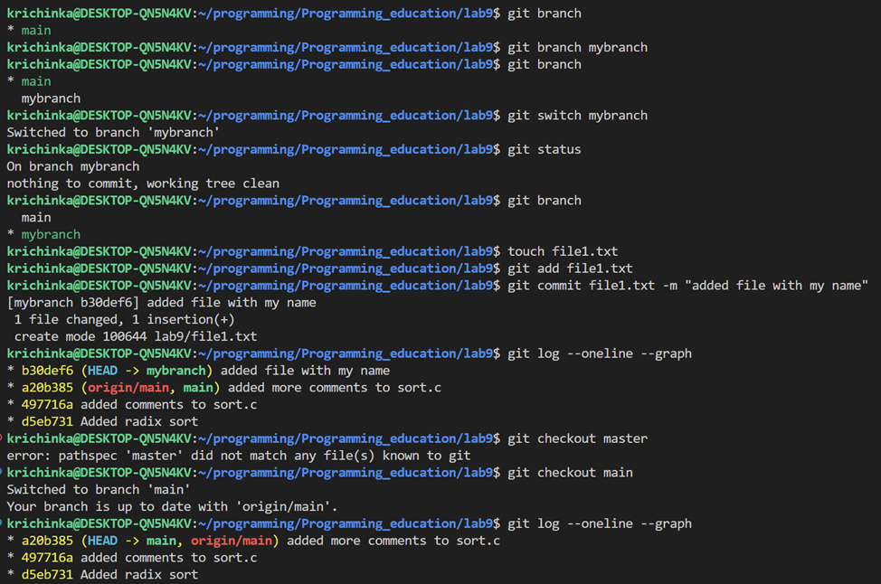

#### 11-13.  

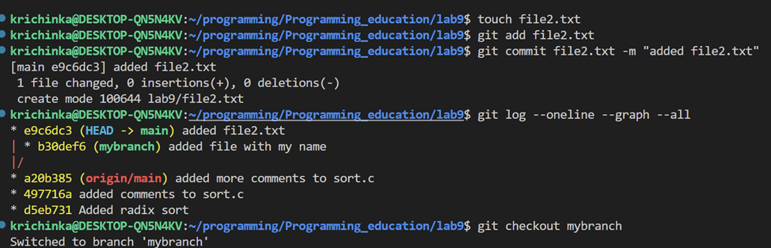

#### 14-17

 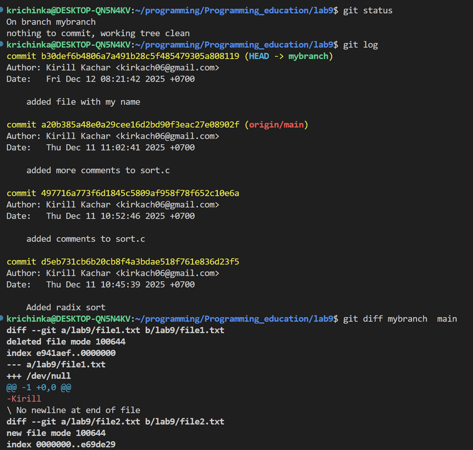

    На 4:
    
#### 1-7
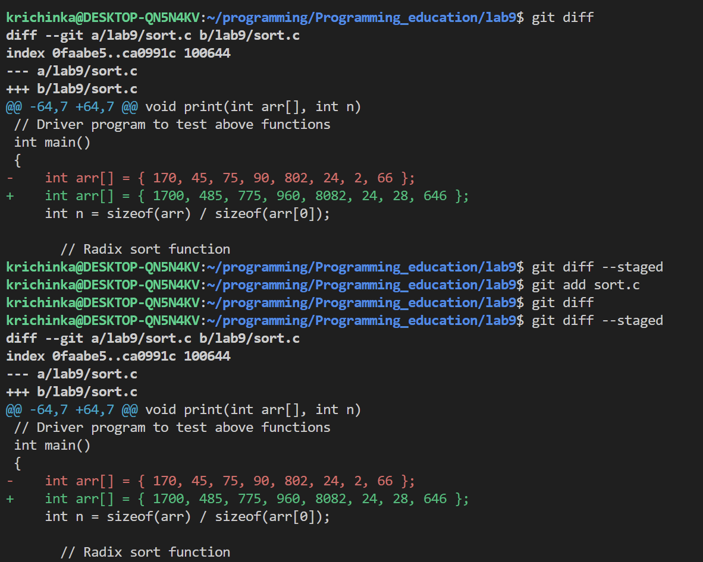

#### 8-10

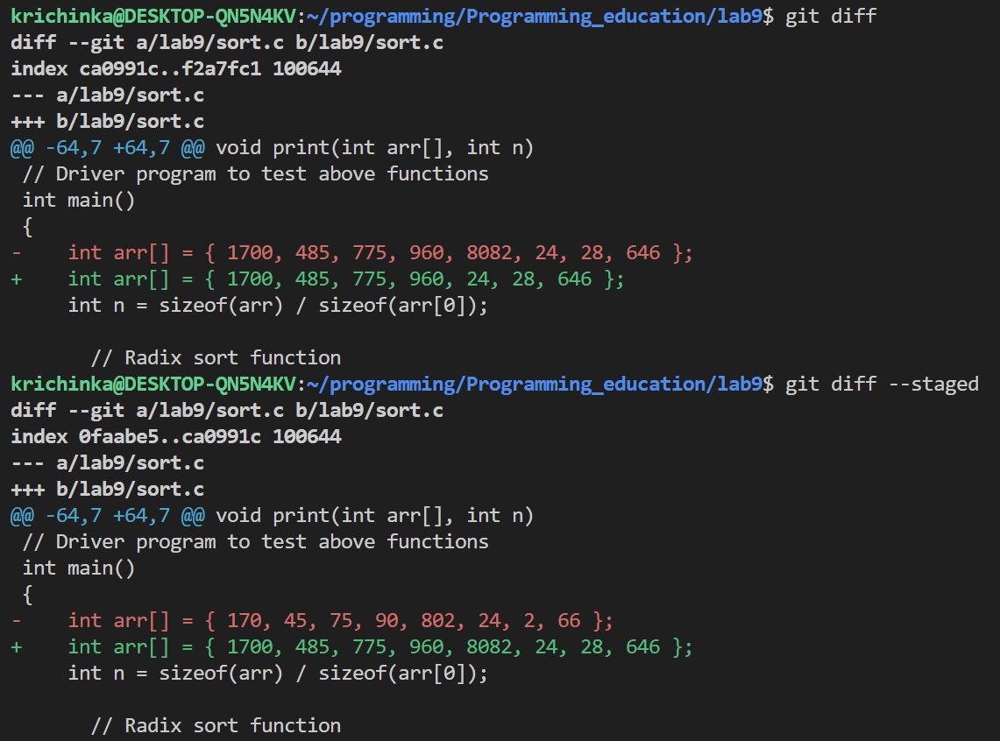

#### 11
Сначала мы сделали изменения в sort.c они изначально появились в виде unstaged, поэтому git diff показывал все изменения, а git diff --staged был пустым. После мы добавили sort.c в staged, поэтому показания git diff и git diff --staged противоположно поменялись. Затем мы сделали еще изменений в sort.c и теперь git diff --staged указывает на изменения, которые уже были добавлены в staged, а git diff указыват на изменения, находящиеся в unstaged

#### 12-15

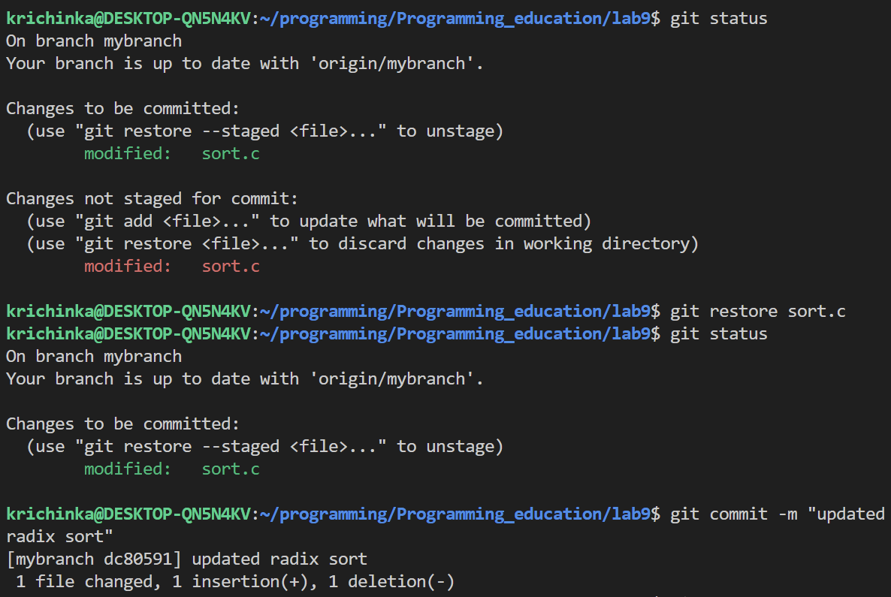

#### 16

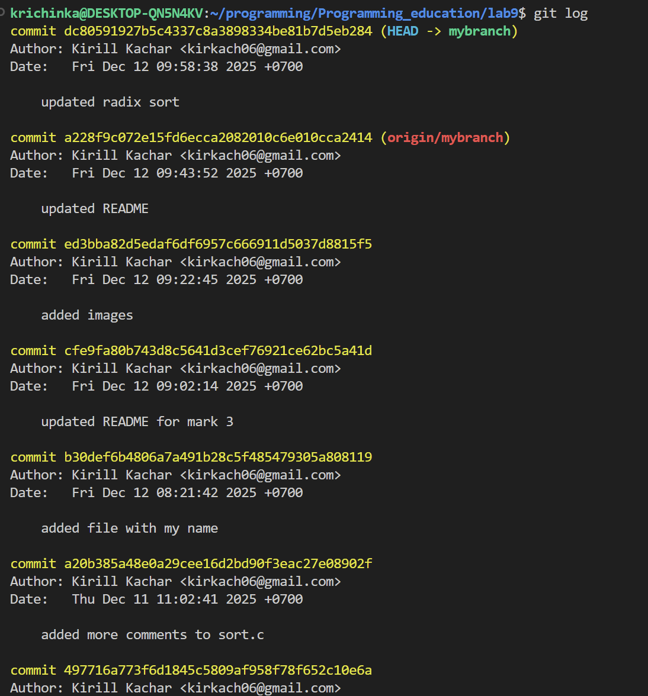

#### 17-18

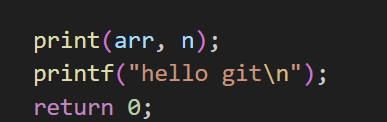

#### 19

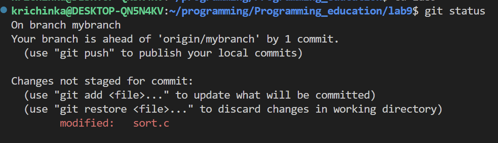

#### 20-21

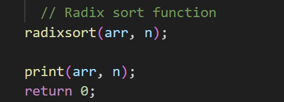

#### 22
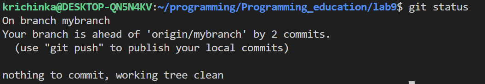

